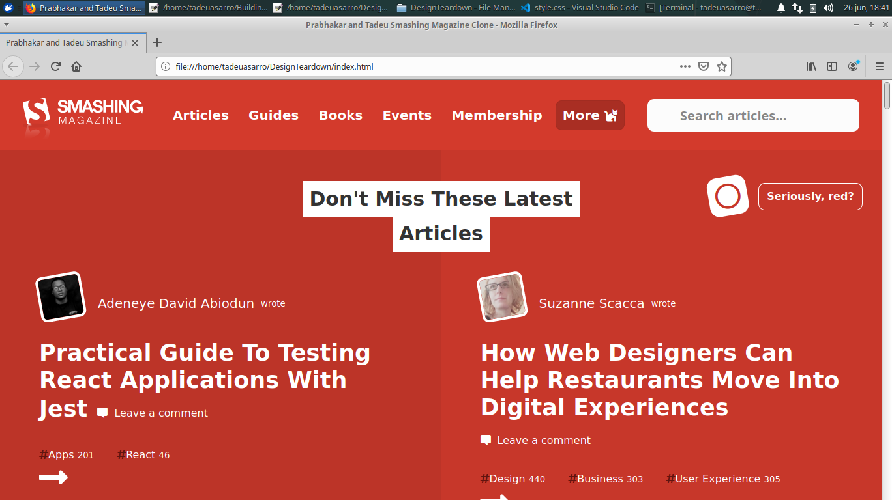

# DesignTeardown
This project is focused on Design and animation through css. In this project we're required to create gray Scale, Headmap [Smashing Magazine Homepage](https://smashingmagazine.com)

In this task we were required to create a grayscale heatmanp clone of smashing magazine using the best practices of HTML AND CSS with GitHub process flow. This project is named design teardown as it also involves intensive design and some animation.

## Built With

- HTML,
- CSS3,

## Live Demo

[Live Demo Link](https://raw.githack.com/tadeuasarro/DesignTeardown/smashing/index.html)

## Authors

👤 Tadeu Sarro

- Github: [@tadeuasarro](https://github.com/tadeuasarro)
- Twitter: [@tadeuasarro](https://twitter.com/tadeuasarro)
- Linkedin: [@tadeuasarro](https://www.linkedin.com/in/tadeu-sarro-71481013a/)

👤 Prabhakar Pandey

- Github: [@githubhandle](https://github.com/Prabhakarzx)
- Twitter: [@twitterhandle](https://twitter.com/prabhakarzx)
- Linkedin: [linkedin](https://www.linkedin.com/in/prabhakarzx/)

## 🤝 Contributing

Contributions, issues and feature requests are welcome!

Feel free to check the [issues page](https://github.com/tadeuasarro/DesignTeardown/issues)

## Show your support

Give a ⭐️ if you like this project!

## Acknowledgments

- Microverse
- GitHub
- TheOdinProject

## 📝 License

This project is open licensed.